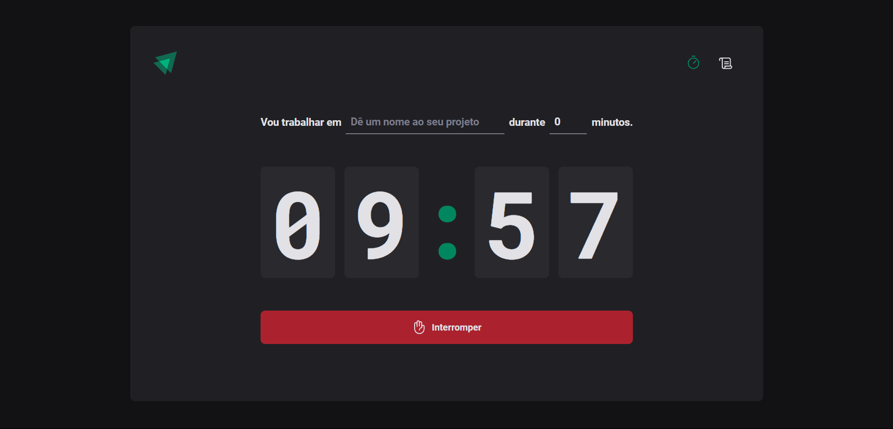

<h1 align="center"> ignite-timer </h1>

  <a href="#-tecnologias">Tecnologias</a>&nbsp;&nbsp;&nbsp;|&nbsp;&nbsp;&nbsp;
  <a href="#-projeto">Projeto</a>&nbsp;&nbsp;&nbsp;|&nbsp;&nbsp;&nbsp;
  <a href="#memo-licença">Licença</a>

  

 

  

## 🚀 Tecnologias

Esse projeto foi desenvolvido com as seguintes tecnologias:

- React
- TypeScript
- react-router-dom
- Styled-Components
- react-hook-form
- Zod

## 🔥 Algumas features neste projeto

- React Hooks
- Navegação em rotas com react-router-dom
- Formulário com react-hook-form e zod
- Estilização com Styled-Components

## ✨ Neste projeto você pode ver

- Um timer no estilo pomodoro onde você pode cronometrar suas tarefas diárias
- Um formulário com validação para o nome e tempo estimado da tarefa
- Uma listagem com todas as tarefas que foram cronometradas e seus status

## 💻 Projeto

- Esta é uma aplicação de timer no estilo pomodoro criada com React e Styled Components

## ✅ Esse projeto foi criado ao longo do curso Ignite ReactJS da plataforma Rocketseat

## 📝 Licença

Esse projeto está sob a licença MIT.

---
